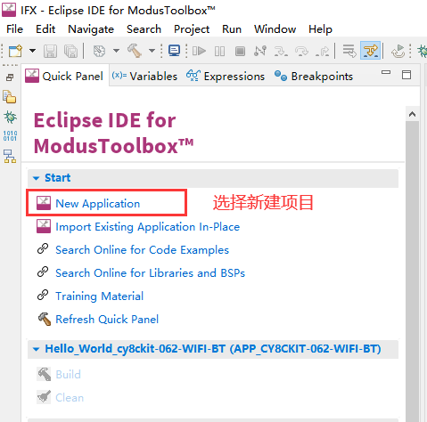
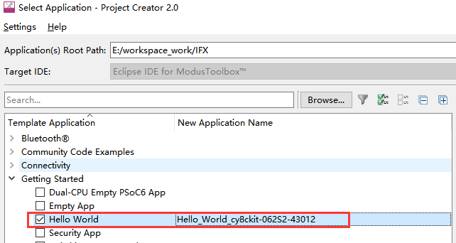
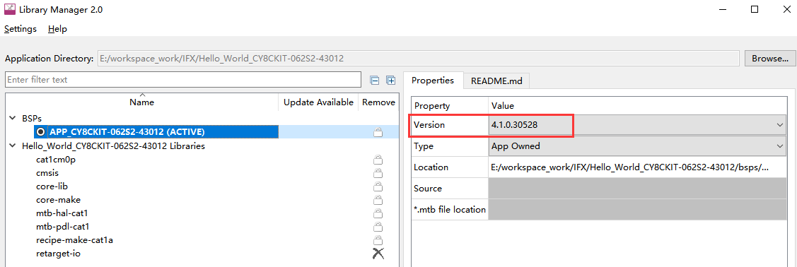
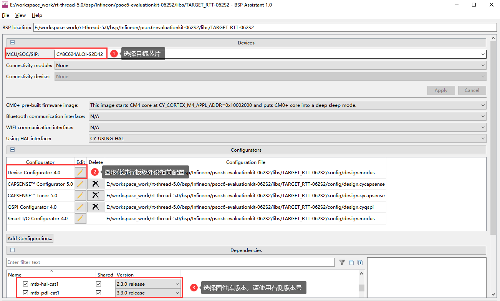
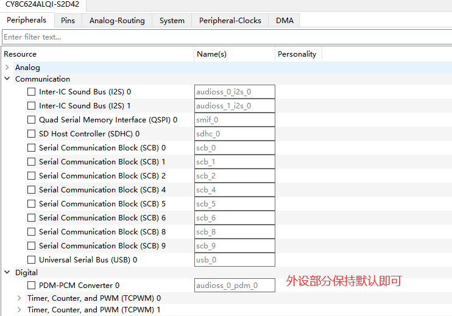
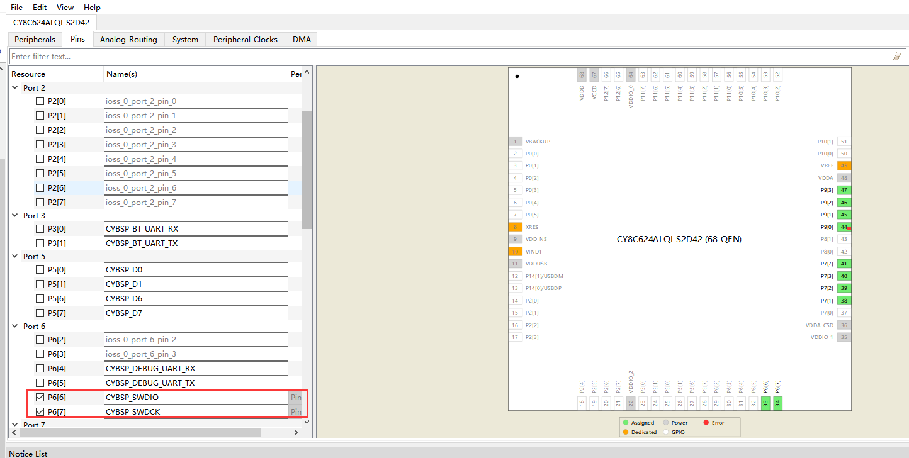
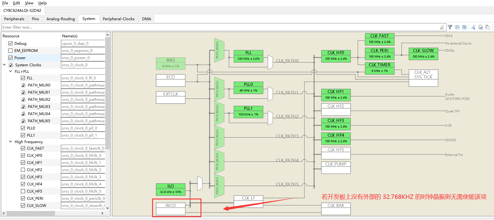

# Infineon-PSOC6 系列 BSP 制作教程

为了让广大开发者更好、更方便地使用 BSP 进行开发，RT-Thread 开发团队为 Infineon-PSOC6 系列推出了 BSP 框架。

BSP 文件夹中不会包含固件库、外设驱动等可以被多个 BSP 引用的代码文件。而是将这些通用的文件统一存放在 Library 文件夹中，通过在特定 BSP 中引用这些文件的方式，来包含 BSP 中所需的库文件或者驱动文件。这种方式不仅大大提高了代码复用率，降低了 BSP 的维护成本，而且可以更方便地给开发者提供更丰富的驱动文件，让开发者可以更容易地找到自己需要的资源。

## 1.BSP 框架介绍 

每一个 PSOC6 系列的 BSP 由三部分组成，分别是通用库、BSP 模板和特定开发板 BSP，下面的表格以 PSOC62 系列 BSP 为例介绍这三个部分：

| 项目                    | 文件夹                              | 说明                                                         |
| ----------------------- | ----------------------------------- | :----------------------------------------------------------- |
| 通用库                  | Infineon/libraries                  | 用于存放 HAL 库以及基于 HAL 库的多系列通用外设驱动文件       |
| PSOC6 系列 BSP 工程模板 | Infineon/libraries/templates/PSOC6X | PSOC6 系列 BSP 模板，可以通过修改该模板制作更多 PSOC6 系列 BSP |
| 特定开发板 BSP          | Infineon/psoc6-cy8ckit-062S2-43012  | 在 BSP 模板的基础上修改而成                                  |

## 2. 知识准备

制作一个 BSP 的过程就是构建一个新系统的过程，因此想要制作出好用的 BSP，要对 RT-Thread 系统的构建过程有一定了解，需要的知识准备如下所示：

- 掌握  PSOC6 系列 BSP 的使用方法

  了解 BSP 的使用方法，可以阅读 [BSP 说明文档](../psoc6-cy8ckit-062S2-43012/README.md) 中使用教程表格内的文档。了解外设驱动的添加方法可以参考《外设驱动添加指南》。

- 了解 Scons 工程构建方法

  RT-Thread 使用 Scons 作为系统的构建工具，因此了解 Scons 的常用命令对制作新 BSP 是基本要求。

- 了解设备驱动框架

  在 RT-Thread 系统中，应用程序通过设备驱动框架来操作硬件，因此了解设备驱动框架，对添加 BSP 驱动是很重要的。

- 了解 Kconfig 语法

  RT-Thread 系统通过 menuconfig 的方式进行配置，而 menuconfig 中的选项是由 Kconfig 文件决定的，因此想要对 RT-Thread 系统进行配置，需要对 kconfig 语法有一定了解。

## 3. BSP 制作方法

本节以制作 `psoc6-cy8ckit-062S2-43012` 开发板的 BSP 为例，讲解如何为一个新的开发板添加 BSP。

BSP 的制作过程分为如下四个步骤：

1. 复制通用模板
2. 修改芯片基本配置文件
3. 修改 BSP 中的 Kconfig 文件
4. 修改构建工程相关文件
5. 重新生成工程

在接下来的章节中将会详细介绍这四个步骤，帮助开发者快速创建所需要的 BSP。

### 3.1 复制通用模板

制作新 BSP 的第一步是复制一份同系列的 BSP 模板作为基础，通过对 BSP 模板的修改来获得新 BSP。目前提供的 BSP 模板系列如下表所示：

| 工程模板                   | 说明                 |
| -------------------------- | -------------------- |
| libraries/templates/PSOC62 | PSOC62 系列 BSP 模板 |

本次示例所用的 PSOC62 系列 BSP 模板文件夹结构如下所示：

在接下来的 BSP 的制作过程中，将会修改 board 文件夹内的配置文件，将 PSOC62 系列的 BSP 模板变成一个适用于 `psoc6-cy8ckit-062S2-43012` 开发板的 BSP ，下表总结了 board 文件夹中需要修改的内容：

| 项目                      | 需要修改的内容说明                        |
| ------------------------- | ----------------------------------------- |
| linker_scripts （文件夹） | BSP 特定的链接脚本                        |
| board.c/h                 | 系统时钟、GPIO 初始化函数、芯片存储器大小 |
| Kconfig                   | 芯片型号、系列、外设资源                  |
| SConscript                | 芯片启动文件、目标芯片型号                |

### 3.2 修改芯片基本配置

在 **board.h** 文件中配置了 FLASH 和 RAM 的相关参数，`IFX_SRAM_SIZE` 这个宏控制的参数。本次制作的 BSP 所用的 CY8CKIT-062S2-43012 芯片 RAM 的大小为 1M，因此对该文件作出如下的修改：

#### 3.2.1 堆内存配置讲解

通常情况下，系统 RAM 中的一部分内存空间会被用作堆内存。下面代码的作用是，在不同编译器下规定堆内存的起始地址 **HEAP_BEGIN** 和结束地址 **HEAP_END**。这里 **HEAP_BEGIN** 和 **HEAP_END** 的值需要和后面  [3.5.1 修改链接脚本](# 3.5.1 修改链接脚本) 章节所修改的配置相一致。

在某些系列的芯片中，芯片 RAM 可能分布在不连续的多块内存区域上。此时堆内存的位置可以和系统内存在同一片连续的内存区域，也可以存放在一片独立的内存区域中。

### 3.3 修改 Kconfig 选项

在本小节中修改 `board/Kconfig` 文件的内容有如下两点：

- 芯片型号和系列
- BSP 上的外设支持选项

芯片型号和系列的修改如下表所示：

| 宏定义               | 意义     | 格式                   |
| -------------------- | -------- | ---------------------- |
| SOC_CY8C624ABZI_S2D44 | 芯片型号 | SOC_CY8C6xxx_xxxx  |
| SOC_SERIES_IFX_PSOC62 | 芯片系列 | SOC_SERIES_IFX_PSOC6x |

关于 BSP 上的外设支持选项，一个初次提交的 BSP 仅仅需要支持串口驱动即可，因此在配置选项中只需保留这两个驱动配置项，如下图所示：

### 3.4 添加外设相关文件

#### 3.4.1 添加底层外设库

接下来为 BSP 添加底层外设库文件，下图的文件是从 Modus 生成的文件夹中拷贝而来。**（只有移植新的系列才需要做此步骤，同 PSOC6 系列无需此步骤）**

Modus 生成的源库文件路径如下图，在 Modus 工作空间下的 `mtb_shared` 文件夹下：**（只有移植新的系列才需要做此步骤，同 PSOC6 系列无需此步骤）**

将以上文件拷贝至 BSP 的 `libraries/IFX_PSOC6_HAL` 文件夹下。**（只有移植新的系列才需要做此步骤，同 PSOC6 系列无需此步骤）**

接下来需要添加板级配置文件，接下来介绍使用英飞凌官方以及非官方开发板的添加步骤：

1、**英飞凌官方开发板步骤**

打开 `ModusToolbox` 软件(版本需 >=V3.0.0)，点击新建项目：

输入开发板型号信息，然后选择下一步：

选择 `Hello World` 模板工程，接下来点击创建该工程：

值得注意的是，`APP_CY8CKIT-062S2-43012` 这个 bsp 需要为 4.1.0 版本：

等待下载完成后，打开对应的 BSP 文件夹，找到 bsps 下生成的文件：

拷贝其中的内容到 RT-Thread 具体 BSP 的 libs文件夹下，例如下图：

同时按照具体路径配置 `SConscript` 脚本文件。

2、**非英飞凌官方开发板步骤**

首先找到 ModusToolbox 安装路径下 `BSP Assistant` 这个软件：

点击 File->New 进行新建项目，按照下图选择目标芯片等：

点击 `Device Configurator 4.0` 后进入图形化配置界面进行外设配置：

引脚部分，swd 的引脚配置是必须的，保持默认即可

时钟相关配置，最初保持默认即可：

全部都配置好后，在界面中按 `ctrl+s ` 即可自动生成配置文件，然后拷贝其中的内容到 RT-Thread 具体 BSP 的 libs文件夹下，例如下图：

同时按照具体路径配置 `SConscript` 脚本文件。

### 3.5 修改工程构建相关文件

接下来需要修改用于构建工程相关的文件。

#### 3.5.1 修改链接脚本

**linker_scripts** 链接文件如下图所示：

以 **GCC** 工具链使用的链接脚本 link.ld 为例，演示如何修改链接脚本：

**方式一（推荐）：**

**FLASH** 和 **RAM** 大小信息可以参考上述拷贝的 **TARGET_CY8CKIT-062S2-43012** 文件夹下的链接脚本，进行修改，其路径在 TARGET_CY8CKIT-062S2-43012/COMPONENT_CM4/TOOLCHAIN_ARM（TOOLCHAIN_GCC_ARM）/cy8c6xxa_cm4_dual.sct（.ld）：

**方式二：**

本次制作 BSP 使用的芯片为  `CY8CKIT-062S2-43012` ，FLASH 为 **2M**，因此修改 FLASH_SIZE 的参数为 `0x00020000`。RAM 的大小为 **1M**， 因此修改 RAM_SIZE 的参数为 `0x000FD800`。修改链接脚本时，可以参考 [**3.2.1 堆内存配置讲解**](# 3.2.1 堆内存配置讲解) 章节来确定 BSP 的内存分配。

---

MDK 编译器使用的 link.sct，修改的方式也是类似的，如下图所示：

* link.sct 修改内容

####  3.5.2 修改构建脚本

**SConscript** 脚本决定 **MDK/IAR/RT-Thread Studio** 工程的生成以及编译过程中要添加文件。

根据具体的路径添加通用外设配置**（只有移植新的系列才需要做此步骤，同 PSOC6 系列无需此步骤）**

添加专有芯片相关文件，如下图：

首次移植，需要使用串口外设**（只有移植新的系列才需要做此步骤，同 PSOC6 系列无需此步骤）**

添加库所使用到的头文件路径，如下图：

在这一步中需要修改芯片型号以及芯片启动文件的地址，修改内容如下图所示：其中 **CPPDEFINES**  的参数要根据芯片底层库中定义的芯片型号去填写。

BSP 下的 lib/SConscript 中需要根据不同编译器选择不同的启动文件。

**注意：**

需要特别注意的是，假如使用的是 GCC 工具链，那么需要对启动文件做如下修改：将原有的 **main** 改成 **entry**

#### 3.5.3 修改编译选项

rtconfig.py 用于选择编译工具链，可以自行在 **CROSS_TOOL** 后面选择修改编译工程所需要的工具链，目前 PSCOC6 支持 GCC 和 ArmClang 两种工具链。

#### 3.5.4 修改工程模板

MDK 为例：

**template** 文件是生成 MDK/IAR 工程的模板文件，通过修改该文件可以设置工程中使用的芯片型号以及下载方式。MDK4/MDK5/IAR 的工程模板文件，如下图所示：

下面以 MDK5 模板的修改为例，介绍如何修改模板配置：

修改程序下载方式：

---

**RT-Thread Studio** 为例，介绍如何导入，修改模板配置：

1、打开 ENV 工具，在工程目录使用 `scons --dist` 命令将工程打包。（整个过程需要保证没有错误）

打包完成后，可以在 BSP 目录下看到生成的 `dist` 文件夹：

使用 dist 后生成的工程就可以直接导入到 RT-Thread Studio 中进行开发了。

打开 RT-Thread Studio ，在 IDE 的左上角点击 `文件—>导入—>RT-Thread Studio 项目到工作空间中`

选择 dist 出来工程的路径：

点击 finsh 即可导入到 Studio 中：

导入成功后，文件资源管理器窗口中会显示如下结构，其中 RT-Thread Settings 为图形化工程配置文件，双击打开即可。

RT-Thread Settings 中硬件相关配置是在 board/Kconfig 中描述的。移植过程如需添加/修改配置，请修改此文件。

### 3.6 重新生成工程

* MDK5 ：重新生成工程需要使用 Env 工具。

* RT-Thread Studio：使用 Env 工具/同步 scons 配置至项目

同步 scons 配置至项目：

#### 3.6.1 重新生成 rtconfig.h 文件

**MDK5：**

在 Env 界面输入命令 menuconfig 对工程进行配置，并生成新的 rtconfig.h 文件。如下图所示：

---

**RT-Thread Studio：**

使用上述方法/点击同步 scons 配置至项目。

#### 3.6.2 重新生成 MDK 工程

以重新生成 MDK 工程为例，介绍如何重新生成 BSP 工程。

使用 env 工具输入命令 `scons --target=mdk5` 重新生成工程，如下图所示：

到这一步为止，新的 BSP 就可以使用了。

接下来我们可以分别使用命令 `scons --target=mdk4` 和 `scons --target=iar`，来更新 MDK4 和 IAR 的工程，使得该 BSP 变成一个完整的，可以提交到 GitHub 的 BSP （MDK4工程的制作为可选）。

---

**RT-Thread Studio：** 使用上述方法/点击同步 scons 配置至项目

感谢每一位贡献代码的开发者，RT-Thread 将与你一同成长。

### 3.7 RT-Thread Studio 下载配置

1、点击 Studio 顶部导航栏中的配置按钮：

2、确保可执行文件选择配置如下图：

3、Debugger 配置项，需按照不同的芯片选择目标文件，OpenOCD 会根据此文件进行烧录：

## 4. 规范

本章节介绍 RT-Thread PSOC6 系列 BSP 制作与提交时应当遵守的规范 。开发人员在 BSP 制作完成后，可以根据本规范提出的检查点对制作的 BSP 进行检查，确保 BSP 在提交前有较高的质量 。

### 4.1 BSP 制作规范

PSOC6 BSP 的制作规范主要分为 3 个方面：工程配置，ENV 配置和 IDE 配置。在已有的 PSOC6 系列 BSP 的模板中，已经根据下列规范对模板进行配置。在制作新 BSP 的过程中，拷贝模板进行修改时，需要注意的是不要修改这些默认的配置。BSP 制作完成后，需要对新制作的 BSP 进行功能测试，功能正常后再进行代码提交。

下面将详细介绍 BSP 的制作规范。

#### 4.1.1 工程配置

- 遵从RT-Thread 编码规范，代码注释风格统一
- main 函数功能保持一致
  - 如果有 LED 的话，main 函数里**只放一个**  LED 1HZ 闪烁的程序
- 在 `rt_hw_board_init` 中需要完成堆的初始化：调用 `rt_system_heap_init`
- 默认只初始化 GPIO 驱动和 FinSH 对应的串口驱动，不使用 DMA
- 当使能板载外设驱动时，应做到不需要修改代码就能编译下载使用
- 提交前应检查 GCC/MDK/IAR 三种编译器直接编译或者重新生成后编译是否成功
- 使用 `dist` 命令对 BSP 进行发布，检查使用 `dist` 命令生成的工程是否可以正常使用

#### 4.1.2 ENV 配置

- 系统心跳统一设置为 1000（宏：RT_TICK_PER_SECOND）
- BSP 中需要打开调试选项中的断言（宏：RT_DEBUG）
- 系统空闲线程栈大小统一设置为 256（宏：IDLE_THREAD_STACK_SIZE）
- 开启组件自动初始化（宏：RT_USING_COMPONENTS_INIT）
- 需要开启 user main 选项（宏：RT_USING_USER_MAIN）
- FinSH 默认只使用 MSH 模式（宏：FINSH_USING_MSH_ONLY）

### 4.2 BSP 提交规范

- 提交前请认真修改 BSP 的 README.md 文件，README.md 文件的外设支持表单只填写 BSP 支持的外设，可参考其他 BSP 填写。
- 提交 BSP 分为 2 个阶段提交：
  - 第一阶段：基础 BSP 包括串口驱动和 GPIO 驱动，能运行 FinSH 控制台。完成 MDK5 、IAR 和 GCC 编译器支持，如果芯片不支持某款编译器（比如MDK4）可以不用做。 BSP 的 README.md 文件需要填写第二阶段要完成的驱动。
  - 第二阶段：完成板载外设驱动支持，所有板载外设使用 menuconfig 配置后就能直接使用。若开发板没有板载外设，则此阶段可以不用完成。不同的驱动要分开提交，方便 review 和合并。
- 只提交 BSP 必要的文件，删除无关的中间文件，能够提交的文件请对照其他 BSP。
- 提交 PSOC6 不同系列的 Library 库时，请参考 PSOC62 系列的 HAL 库，删除多余库文件
- 提交前要对 BSP 进行编译测试，确保在不同编译器下编译正常
- 提交前要对 BSP 进行功能测试，确保 BSP 的在提交前符合工程配置章节中的要求
