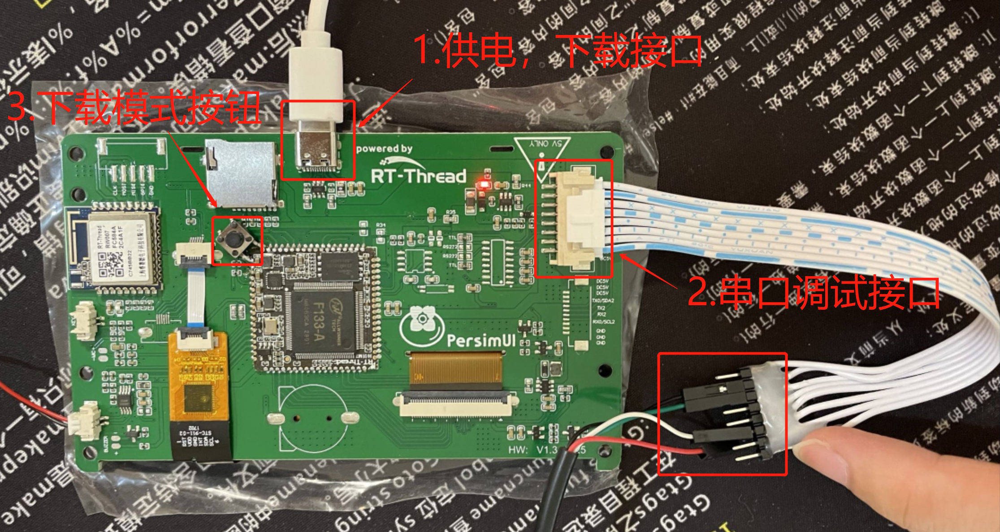

# 基于柿饼M7（F133）运行RT-Smart

## 准备工作

#### 开发环境

推荐使用 ubuntu20.04(虚拟机/docker/服务器) + Window10/11

- ubuntu：用于编译、开发、打包镜像
- windows：用于下载打包好的镜像

#### 常用工具

**Ubuntu:**

```bash
sudo apt install libncurses5-dev scons gcc qemu-system
```

- qemu：用于仿真运行RISC-V程序
- gcc：用于编译menucofig的程序
- libncurses5-dev ：menucofig功能依赖此库
- scons：编译RT-Smart需要的构建工具

**Windows:**

- vscode：windows上安装，用于远程连接ubuntu系统，可以在win上体验原生的linux开发环境。
- MobaXterm：终端工具，可以ssh远程ubuntu系统，也可以通过串口连接柿饼M7模块
- env_riscv_1.1.3.zip：针对risc-v平台的ENV工具。

#### 相关仓库权限

- https://gitee.com/guozhanxin/rtthread-smart/tree/master：rtthread-smart主仓库 
- https://gitee.com/rtthread/rt-thread ：rtthread内核仓库，以submodule的形式存在于rtthread-smart仓库中，这里使用的是rt-smart分支

获取上面的仓库权限，并将rtthread-smart克隆到ubuntu系统目录下。目录结构如下所示：

```bash
blue@blue:~/work$ tree -L 1
.
└── rtthread-smart
```

在做好上面的准备后，就可以真正的开始搭建RT-Smart的开发环境了。

## 模拟仿真环境搭建

在真实的硬件上开发之前，可以先搭建基于QEMU的模拟仿真环境。

参考这篇文章，完成 qemu-riscv64 上 RT-Smart 环境搭建：https://gitee.com/guozhanxin/rtthread-smart/tree/master/docs/risc-v64

最后能够在 qemu-riscv64 上正常运行RT-Smart系统，并运行一个 `hello.elf` 用户态应用。

```
msh /bin>hello.elf
msh /bin>hello world!
```

## 真实硬件环境搭建

#### 硬件连接

按照下图中的连接方式，为开发板供电，并使用USB转TTL工具连接串口调试。



#### 驱动安装

1. 按住下载模式按钮的情况下为开发板上电。

2. 解压tools目录下fel驱动安装.zip文件。参照如下所示的“驱动安装示意图”，安装fel驱动。


#### 连接串口工具

打开 MobaXterm 终端工具，并连接到对应的端口，波特率为：500000。

>  注意：如果系统没有固件的话，不会有任何输出，是正常现象。


#### 制作系统固件

参照 qemu-riscv64 上编译内核的步骤，配置环境变量，并使用 scons 命令编译 RT-Smart 内核

```bash
blue@blue:~/work/rtthread-smart/ibsp/f133$ scons -j12
scons: Reading SConscript files ...
b''
scons: done reading SConscript files.
scons: Building targets ...
scons: building associated VariantDir targets: build
CC build/applications/main.o
CC build/applications/mnt.o
... ...
CC /home/blue/work/rtthread-smart/ibsp/libraries/sunxi-hal/hal/source/twi/hal_twi.o
CC /home/blue/work/rtthread-smart/ibsp/libraries/libos/src/os.o
LINK rtthread.elf
riscv64-unknown-linux-musl-objcopy -O binary rtthread.elf rtthread.bin
riscv64-unknown-linux-musl-size rtthread.elf
   text    data     bss     dec     hex filename
7221249   59608  269222 7550079  73347f rtthread.elf
./mksdimg.sh
Allwinner TOC1 Image
Size: 7413760 bytes
Contents: 3 items
 00000000:00000490 Headers
 00000600:000188e0 => 40000000 opensbi
 00019000:00007475 => 40200000 dtb
 00020600:006f18f8 => 40400000 kernel
scons: done building targets.
```

编译完内核之后，会自动执行打包命令 `./mksdimg.sh` 打包出sd.bin镜像文件。此文件将在后面的步骤中借助下载工具，下载到 F133 上运行。

#### 烧录系统内核

我们借助fel工具烧录系统内核。

1. 解压tools目录下的xfel_v1.2.9.7z文件，里面包含三个文件

```
boot0_sdcard_sun20iw1p1_f133.bin   ---- 第一次烧录需要烧录此boot文件
sd.bin                             ---- 打包好的系统内核镜像
xfel.exe                           ---- 烧录工具
```

2. 解压tools目录下env_riscv_1.1.3.zip文件，打开env工具，并进入解压好的 xfel_v1.2.9 目录下。运行下面的命令烧录系统内核

- 烧录boot镜像： xfel.exe write 8192 boot0_sdcard_sun20iw1p1_f133.bin
- 烧录内核镜像： xfel.exe sd write 57344 sd.bin
- 复位系统： xfel.exe reset

>  注意：执行烧录命令前，需要使开发板处于fel下载模式（按住下载按钮并上电）

日志如下所示：

```
11714@DESKTOP-VEL6MD9 E:\workspace\d1s-smart\env_riscv_1.1.3
> cd E:\workspace\d1s-smart\xfel_v1.2.9

11714@DESKTOP-VEL6MD9 E:\workspace\d1s-smart\xfel_v1.2.9
> xfel.exe write 8192 boot0_sdcard_sun20iw1p1_f133.bin
ERROR: Can't found any FEL device  ----  如果开发板没有处于fel下载模式的话，会提示错误。

## 第一次使用需要先烧录boot镜像文件
11714@DESKTOP-VEL6MD9 E:\workspace\d1s-smart\xfel_v1.2.9
> xfel.exe write 8192 boot0_sdcard_sun20iw1p1_f133.bin
100% [================================================] 48.000 KB, 364.927 KB/s

## 烧录内核镜像文件
11714@DESKTOP-VEL6MD9 E:\workspace\d1s-smart\xfel_v1.2.9
> xfel.exe sd write 57344 sd.bin
write 7240Kbytes
swap buf:00023E00,len=512, cmdlen=512
Found SD card 126877696 bytes
100% [================================================] 7.070 MB, 219.468 KB/s

## 复位系统
11714@DESKTOP-VEL6MD9 E:\workspace\d1s-smart\xfel_v1.2.9
> xfel.exe reset
usb bulk recv error
```

如果此时连接着MobaXterm终端工具，可以看到系统以及正常启动，并可以通过msh命令和系统交互了。

```
[I/I2C] I2C bus [i2c2] registered

 \ | /
- RT -     Thread Smart Operating System
 / | \     5.0.0 build Sep  8 2022
 2006 - 2020 Copyright by rt-thread team
Dir /mnt mount failed!
gt9xx_probe
Hello RISC-V
msh />[E/DBG] [twi2] incomplete xfer (status: 0x20, dev addr: 0x14)

[E/DBG] i2c xfer failure

[E/DBG] [twi2] incomplete xfer (status: 0x20, dev addr: 0x5d)

[E/DBG] i2c xfer failure

[E/TOUCH.gt9xx] Failed to fetch GT9XX ID at the address 0x14/0x5d
[E/TOUCH] [TP] No touch pad or driver.

msh />ls
Directory /:
bin                 <DIR>
msh />ps
thread               pri  status      sp     stack size max used left tick  error
-------------------- ---  ------- ---------- ----------  ------  ---------- ---
tshell                20  running 0x000007b8 0x00002000    25%   0x0000000a -09
disp2                 15  suspend 0x00000288 0x00002000    31%   0x00000003 000
sys_work              23  suspend 0x00000288 0x00000800    31%   0x0000000a 000
tidle0                31  ready   0x00000268 0x00004000    04%   0x00000008 000
timer                  4  suspend 0x00000278 0x00004000    03%   0x0000000a 000
msh />
```

#### 运行用户态应用

在F133上运行系统应用有两种方式：一种是制作roofs.bin并借助fel工具烧录到sdmmc对应的位置上；二是使用romfs的方式，和内核镜像编译在一起，然后整个的烧录到sdmmc上。下面介绍第二种方式。

**借助romfs运行用户态应用**

这部分可以参考 qemu-riscv64 上运行用户态应用的部分。使用 python 命令将 userapps 下 root 目录下的用户态应用打包为  `romfs.c` ，并重新编译系统内核，重复上面的系统内核烧录步骤。最后复位并运行系统。参照下面的运行日志，运行对应的用户态应用。

```
msh />cd bin
msh /bin>ls
Directory /bin:
syslogd.elf         423024
ping.elf            368104
webserver.elf       510216
hello.elf           366096
em.elf              601336
pong.elf            367024
syslog.elf          391128
vi.elf              528096
hdc_test.elf        367520
ntp.elf             392168
mmapctrl.elf        366992
pmq.elf             371600
webclient.elf       413784
lwIPKit.elf         998504
msh /bin>hello.elf
msh /bin>hello world!
```

