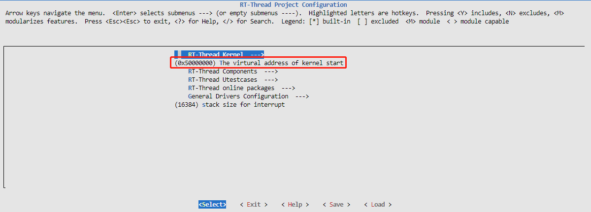
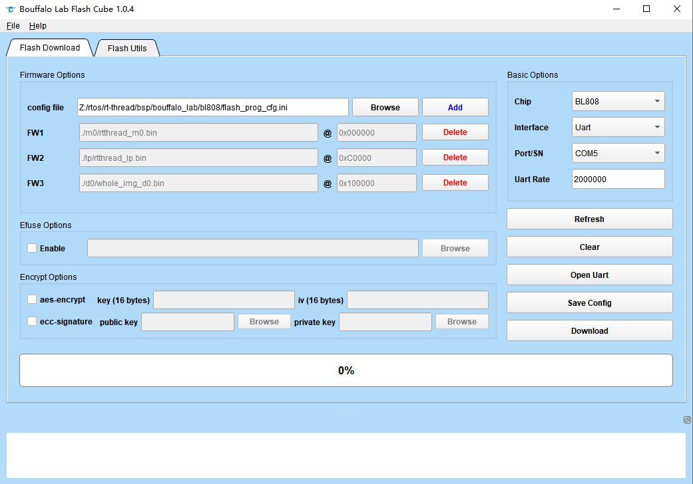

# 博流智能 BL808板级支持包说明

## 1. 简介

BL808 是高度集成的 AIoT 芯片组，具有 Wi-Fi/BT/BLE/Zigbee 等无线互联单元，包含多个 CPU 以及音频编码译码器、视频编码译码器和 AI 硬件加速器，适用于各种高性能和低功耗应用领域。

BL808 系列芯片主要包含无线和多媒体两个子系统。

无线子系统包含一颗 RISC-V 32-bit 高性能 CPU（m0），集成 Wi-Fi/BT/Zigbee 无线子系统，可以实现多种无线连接和数据传输，提供多样化的连接与传输体验。
多媒体子系统包含一颗 RISC-V 64-bit 超高性能 CPU（d0），集成 DVP/CSI/ H264/NPU 等视频处理模块，可以广泛应用于视频监控/智能音箱等多种 AI 领域

多媒体子系统组成部分如下：

- NPU HW NN 协处理器 (BLAI-100)，适用于人工智能应用领域
- 摄像头接口
- 音频编码译码器
- 视频编码解码器
- 传感器
- 显示接口

电源管理单元控制低功耗模式。此外，还支持各种安全功能。

外围接口包括 USB2.0、 Ethernet、 SD/MMC、 SPI、 UART、 I2C、 I2S、 PWM、 GPDAC/GPADC、 ACOMP、 PIR、 Touch、
IR remote、 Display 和 GPIO。

支持灵活的 GPIO 配置， BL808 最多可达 40 个 GPIO。  

芯片规格包括如下：

| 硬件 | 描述 |
| -- | -- |
|芯片型号| bl808 |
|CPU| 三核异构RISC-V CPUs： <br />RV64GCV 480MHz<br/>RV32GCP 320MHz<br/>RV32EMC 160MHz |
|RAM| 768KB SRAM + 64MB UHS PSRAM |
| 外设 | 内嵌AES与SHA256算法加速器 |
| AI NN 通用硬件加速器 | BLAI-100 用于视频/音频检测/识别，100GOPS 算力 |
| 摄像头接口 | DVP 和 MIPI-CSI |
| 显示接口 | SPI、DBI、DPI(RGB) |
| 无线 | 支持 Wi-Fi 802.11 b/g/n<br/>支持 Bluetooth 5.x Dual-mode(BT+BLE)<br/>支持 Wi-Fi / 蓝牙 共存 |


## 2. RT-Thread 版本

BL808是三核异构架构，分别为m0、lp、d0，当前bsp已实现三核同时启动，三核分别采用了不同的RT-Thread版本

| 名称 | CPU核 | RT-Thread版本    |
| ---- | ----- | ---------------- |
| M0   | E907  | RT-Thread 标准版 |
| LP   | E902  | RT-Thread Nano   |
| D0   | C906  | RT-SMART         |


## 3.  编译说明

BL808是三核异构架构，分别为m0、lp、d0，三核需要单独编译，并烧录到对应的位置。

烧录地址：

| 名称 | CPU核 | 烧录地址 | 说明                                                         |
| ---- | ----- | -------- | ------------------------------------------------------------ |
| M0   | E907  | 0x00000  |                                                              |
| LP   | E902  | 0xC0000  | 调整lp烧录地址需修改<br>`bsp/bouffalo_lab/bl808/lp/board/linker_scripts/bl808_flash_lp.ld`中的xip_memory地址<br>`bsp/bouffalo_lab/bl808/m0/board/board.h`中`CONFIG_LP_FLASH_ADDR`地址 |
| D0   | C906  | 0x100000 | 在spl文件中设定，调整d0烧录地址需重新编译spl文件及打包文件`bsp/bouffalo_lab/bl808/d0/merge_rtsmart.py` |


### 3.1.  m0/lp

- #### 工具链下载


下载risc-v的工具链，[下载地址1](https://occ.t-head.cn/community/download?id=4073475960903634944)或[下载地址2](https://dl.sipeed.com/shareURL/others/toolchain)

Windows下请使用使用[env工具][1]，使用命令 `tar -xvf Xuantie-900-gcc-elf-newlib-mingw-V2.6.1-20220906.tar.gz` 解压交叉编译器，使用Windows下解压工具直接解压可能出现Windows下编译错误。

在`rtconfig.py`中将risc-v工具链的本地路径加入 `EXEC_PATH` 或通过 `RTT_EXEC_PATH` 环境变量指定路径

Windows：
```
set RTT_EXEC_PATH=C:\Users\xxxx\Downloads\Xuantie-900-gcc-elf-newlib-x86_64-V2.6.1\bin
```

Linux:
```
export RTT_EXEC_PATH=/opt/Xuantie-900-gcc-elf-newlib-x86_64-V2.6.1/bin
```

- ### 编译

Windows下推荐使用[env工具][1]，在console下进入bsp/bl808目录中，选择需要编译的核心，m0或lp，运行：

    cd bsp/bl808/m0
    menuconfig
    pkgs --update

如果在Linux平台下，可以先执行：

    scons --menuconfig

它会自动下载env相关脚本到~/.env目录，然后执行

    source ~/.env/env.sh
    
    cd bsp/bl808/m0
    pkgs --update

更新完软件包后，执行 `scons -j10` 或 `scons -j10 --verbose` 来编译这个板级支持包。或者通过 `scons --exec-path="GCC工具链路径"` 命令，在指定工具链位置的同时直接编译。

如果编译正确无误，会产生rtthread.elf、rtthread_m0.bin文件。其中rtthread_m0.bin需要烧写到设备中进行运行。  


- #### 注意

  由于BL808为三核异构，lp核、d0核都是通过m0核启动的，必须正确烧录m0核才可以实现三核正常运行

  m0烧录配置文件：`bsp/bouffalo_lab/bl808/m0/flash_prog_cfg.ini`

  

### 3.2. d0

bl808-d0运行在S态下，支持RT-Smart，采用的交叉编译器为`riscv64-unknown-linux-musl-gcc`，编译请参考[构建内核镜像](https://www.rt-thread.org/document/site/#/rt-thread-version/rt-thread-smart/quick-start/qemu-linux/quickstart?id=%e6%9e%84%e5%bb%ba%e5%86%85%e6%a0%b8%e9%95%9c%e5%83%8f)

其中内核虚拟地址开始地址为`0x50000000`



bl808-d0编译完成后通过`merge_rtsmart.py`脚本，将`hw.dtb.5M`,`spl_bl808_d0.bin`，`opensbi_v0.6.bin`与`rtthread_d0.bin`，合成最终烧录文件`whole_img_d0.bin`，烧录地址为`0x100000`，否则无法启动。

预编译bin文件位于`bsp/bouffalo_lab/bl808/d0/pre_build_bin`文件夹下，如有修改需求可下载[Low-Starup-BL808](https://github.com/flyingcys/Low-Starup-BL808)后自行修改。

d0单独烧录文件为`bsp/bouffalo_lab/bl808/d0/flash_prog_cfg.ini`


### 3.3. 三核同时编译与烧录

- 可运行`bsp/bouffalo_lab/bl808/build_bl808_all.sh`依次编译m0、lp、d0核
- 可通过`bsp/bouffalo_lab/bl808/flash_prog_cfg.ini`烧录配置文件，同时烧录m0、lp、d0核。




## 4. FAQ

- 在 windows 环境下，通过 UART 接口将开发板连接至电脑时，仅能识别到两个 USB converter 设备，但是识别不到对应的串口设备。
  - 进入到设备管理器中，右击对应的 USB converter 设备，进入到属性中的高级设置，钩选 vcp 选项，刷新后即可看到对应的串口设备。
  - 也可通过安装以下驱动解决问题： https://dl.sipeed.com/shareURL/MAIX/tools/ftdi_vcp_driver
- 使用 TypeC 数据线将电脑与板子的 UART 口连接起来，此时电脑上会出现两个串口 （如果出现鼠标不能动的现象请拔掉 USB 并且查看 [更新板载 bl702 固件](https://wiki.sipeed.com/hardware/zh/maix/m1s/other/start.html#给板载-bl702-进行烧录) 相关内容来修复问题)。
